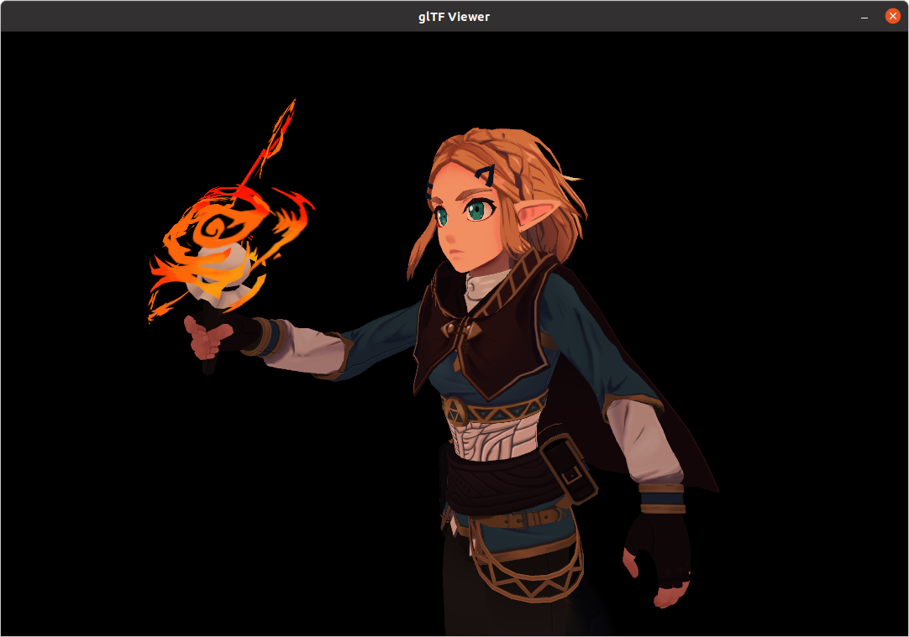

# glTF_Viewer
glTF animation viewer using TinyglTF

## Build

``` bash
sudo apt-get install xorg-dev
# clone libs
git submodule update --init --recursive

mkdir build
cd build
cmake .. && make -j4
./glTF_viewer -h
```

## Usage

```
Usage: glTF_viewer [options] glTF_model_path 

Positional arguments:
glTF_model_path         glTF model path.

Optional arguments:
-h --help               show this help message and exit
-x --width              specify the width.
-y --height             specify the height.
```

Use <kbd>w</kbd>,<kbd>a</kbd>,<kbd>s</kbd>,<kbd>d</kbd> to move the camera, use mouse to rotate camera. Press <kbd>0</kbd> to hide cursor.

## Feature

* [x] Morph Targets
* [x] Skeleton Animation
* [x] PBR
* [x] OIT


Author : patrix

[url: https://sketchfab.com/3d-models/sci-fi-girl-v02-walkcycle-test-07ac452d75cc47969234b224422ea85d]



Author : theStoff

[url: https://sketchfab.com/3d-models/zelda-breath-of-the-wild-bf99374334a64291ae2876c83269adb6]

## Todo List

* [ ] Improve render quality.

## Library Used
- GLFW              [url: https://github.com/glfw/glfw]
- GLM               [url: https://github.com/g-truc/glm/]
- GLAD              [url: https://glad.dav1d.de/]
- tinyglTF          [url: https://github.com/syoyo/tinygltf]

## Acknowledge
- glTF_Animation [url: https://github.com/HK416/glTF_Animation]

Refer to **glTF_Animation**'s code to load glTF and skeleton animation.